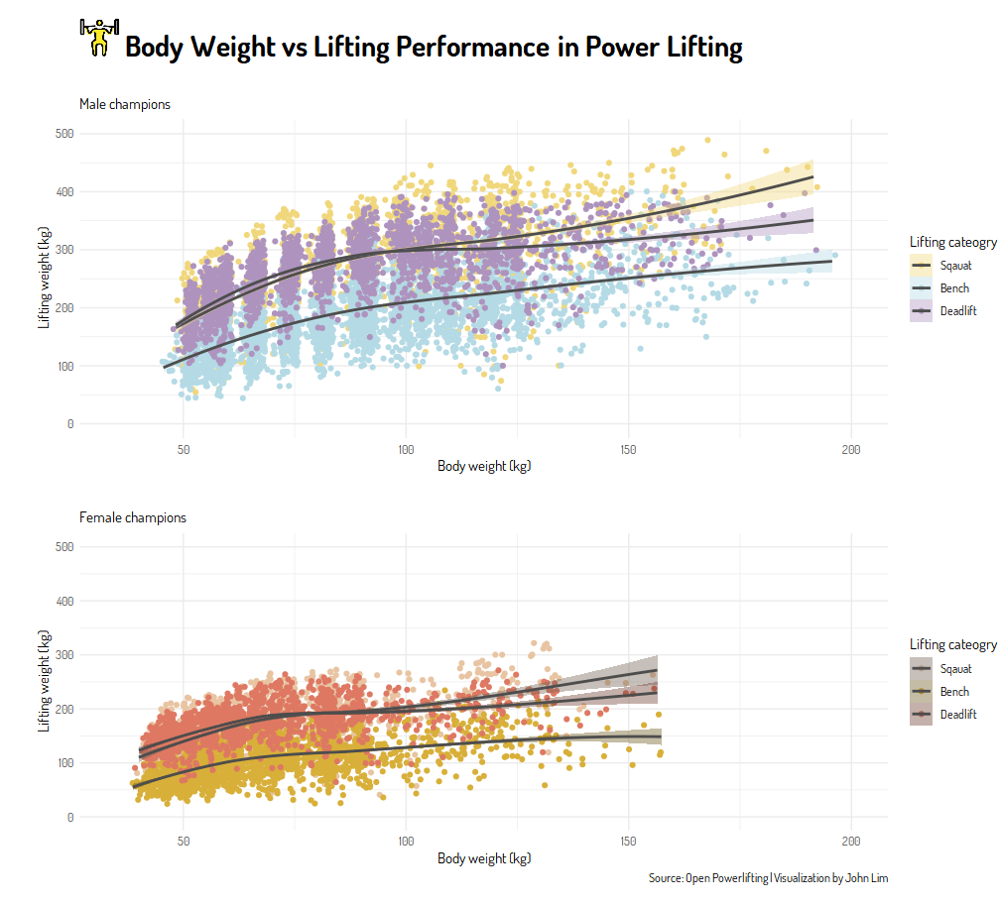
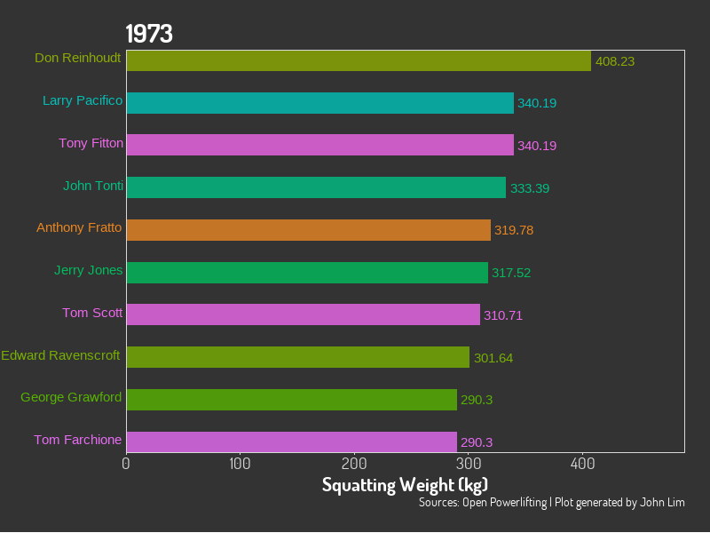

# TidyTuesday

## [[2019-10-15] 🚗💨 Tailpipe CO2 Emission Average, 2013-2020](./R/2019_42/)

***

## [[2019-10-08] 🏋️ Body Weight vs Lifting Performance](./R/2019_41/)

***
## [[2019-10-01] 🍕 Top 10 Pizza places in NY](./R/2019_40/)

***

#### Attribution-NonCommercial-ShareAlike 4.0 International (CC BY-NC-SA 4.0)
